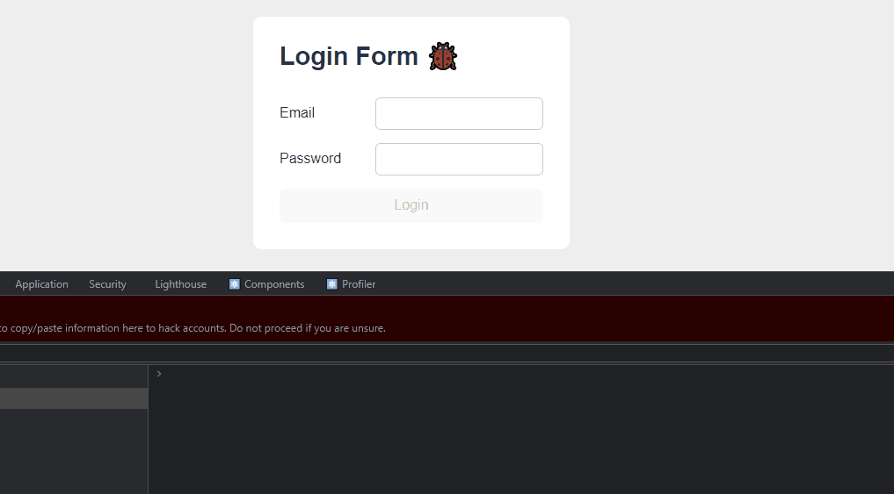

# Tech Test - React Form
_Link:_
 
👉 https://react-tech-test-3kw6al3xu-paulomonezi.vercel.app

_Languages:_ 
 
- 🌎 Também disponível em pt-BR aqui 👉 [Aqui](https://github.com/paulomonezi/react-tech-test/blob/main/README.ptBR.md)

## 💻 About 
This project is about an tech test from an interview for junior/entry level react developer 
Another person has made this form, but still somehow bugged and incomplete, my task was fix it and push to production asap 
  

### 📑 Instructions

* You have an UNFINISHED login form
* Adding new HTML elements it not allowed
* It's not allowed to use refs 
  

### 🖱️ Tasks:

* The login button should call the function `login()`, imported on top of the file
* Disable the Login button if the e-mail field is empty OR the password has less than 6 characters
* Disable the Login button while you waiting for `login()` function
* Show an error message if login fails. The message should be clear at each new loggin attempt 
* Show an alert if the login has succeed (`alert()`). Investigate the `login()` function to understand how to succeed on the request 
  

### 🚀 What i've done 
Besides completing those tasks above using `useState`:
* I've used conditional rendering on the div that displays the error message
* Used `onKeyDown` to acess the Login button with 'Enter' key to UX purposes 

    

#### 🙏 Special Thanks
I wanna thank to [Fernandev](https://github.com/nandokferrari), for making this challenge avaliable on his GitHub! 
https://github.com/nandokferrari/fernandev-react-challenge-02 
If you want to try this out, you can clone the repository above, or just clone this repo at the initial commit